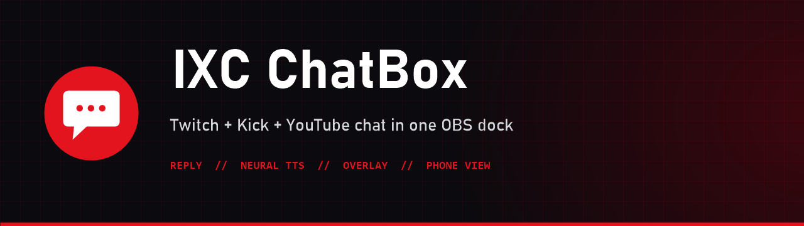
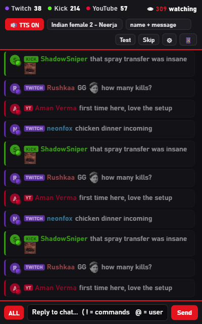

<div align="center">



[](https://github.com/infernoxc/ixc-chatbox/releases/latest)
[](https://github.com/infernoxc/ixc-chatbox/actions/workflows/ci.yml)
[](LICENSE)


**Twitch, Kick and YouTube chat in one OBS dock, with replies, chat text-to-speech, an on-stream overlay and a phone remote that works over mobile data.**

[**⬇ Download the latest release**](https://github.com/infernoxc/ixc-chatbox/releases/latest) · [Install guide](docs/INSTALL.md) · [How to use](docs/USAGE.md) · [Troubleshooting](docs/TROUBLESHOOTING.md)

</div>

---



## Features
- 💬 **One chat for every platform:** Twitch, Kick and YouTube in one list, each message tagged **TWITCH**, **KICK** or **YT**.
- 😀 **Emotes, badges and avatars**, 📊 **live viewer counts**, a scrolling **dock** and a fading **overlay**.
- ✍️ **Reply box:** send to **All**, Twitch, Kick or YouTube. `!` suggests your bot commands, `@` suggests chatters; click a message to reply.
- 🔊 **Chat TTS that really reads chat:** it runs inside IXC itself, so it works whenever IXC runs, not only while a dock page is open.
  - **7 neural voices**, including two new faster Indian ones (*Neerja Expressive* and *Madhur*), and an **offline Windows voice** as a fallback.
  - **Ignore my account**, **ignore bots**, a **never-speak list** and **blocked words**.
  - Cleans up links, emotes, emoji, shouting and spam.
  - Handles busy chat: one read per message mirrored on several platforms, queue size, stale-message drop, per-user and per-minute limits.
  - Speed, pitch and volume; **queue, history, replay, skip, clear**.
- 📱 **Phone remote from anywhere:** scan a QR code to control chat, TTS and music from your phone, on mobile data too, through an encrypted Cloudflare tunnel. No router setup. One-time pairing codes, and nothing on your PC is exposed without pairing.
- 🩺 **Diagnostics page:** connections, TTS engine and queue, phone tunnel, CPU and RAM, recent events.

<br clear="right">

## Requirements
| | |
|---|---|
| Windows | 10 or 11 (Windows PowerShell 5.1 and .NET Framework 4.8 are built in) |
| OBS Studio | 30 or newer |
| [Streamer.bot](https://streamer.bot) | 1.0 or newer (free), connected to your platforms, with its **WebSocket Server** on |
| Internet | For the platforms, neural voices, emote images and the phone remote |
| Tested on | Windows 11 (build 26200), OBS Studio 32.2.2, Streamer.bot 1.0.7 |

## Install
1. Download **`IXC-ChatBox-Setup-vX.Y.Z.exe`** or the portable **`.zip`** from [Releases](https://github.com/infernoxc/ixc-chatbox/releases/latest).
2. Close OBS and run it (or unzip and double-click **`Install.bat`**). No admin rights needed.
3. In Streamer.bot turn on **Servers/Clients › WebSocket Server** (`127.0.0.1:8080`, Auto Start). Turn on authentication for replies.
4. In OBS add:

| Add in OBS | URL |
|---|---|
| Docks › Custom Browser Docks: **IXC ChatBox** | `http://localhost:8767/chat/chat.html?dock=1&viewers=1` |
| Browser source **IXC ChatBox TTS** (✅ Control audio via OBS) | `http://localhost:8767/chat/tts.html` |
| Browser source for on-stream chat *(optional)* | `http://localhost:8767/chat/chat.html?max=6&fade=45` |

Step by step: **[docs/INSTALL.md](docs/INSTALL.md)**. Updating from v1? Just run the new installer: see [docs/UNINSTALL.md](docs/UNINSTALL.md#update-to-a-new-version).

## Honest limitations
- The neural voices use Microsoft Edge's **unofficial** "Read aloud" service. It's free, but undocumented, and it can change or stop. IXC then switches to the offline Windows voice automatically and tells you so in the dock and diagnostics.
- There's only **one Indian English male** neural voice (Prabhat). The new male voice, *Madhur*, is a Hindi voice that reads English with an Indian accent. Offline Indian voices (Heera, Ravi) appear only if you install Windows' *English (India)* speech pack.
- ElevenLabs isn't built in: its free tier is small and needs an account and key.
- **Phone remote:** Cloudflare's free quick tunnels are meant for testing, with no uptime guarantee. The phone address changes every time the tunnel restarts, so you scan a new QR code (one tap in the dock).

## Documentation
[Install](docs/INSTALL.md) · [Usage](docs/USAGE.md) · [Configuration](docs/CONFIGURATION.md) · [Troubleshooting](docs/TROUBLESHOOTING.md) · [Update and uninstall](docs/UNINSTALL.md) · [Architecture and API](docs/ARCHITECTURE.md) · [Releasing](docs/RELEASING.md)

## Build from source
```powershell
git clone https://github.com/infernoxc/ixc-chatbox.git
cd ixc-chatbox
powershell -ExecutionPolicy Bypass -File tests\smoke.ps1 -Online     # tests (builds IXC Core in a temp folder)
powershell -ExecutionPolicy Bypass -File scripts\install.ps1 -AddObsDocks
powershell -ExecutionPolicy Bypass -File build\build.ps1 -Installer  # dist\ ZIP + Setup.exe (needs Inno Setup 6)
```

## Privacy and security
- Everything runs **on your PC**. IXC Core listens on `localhost` only, and refuses API calls from other websites.
- **No accounts or API keys needed.** Replies go through your own Streamer.bot; its password is read on your PC and never sent to a page or phone.
- The **phone remote is off until you open the QR code**. Only the phone page and an authenticated connection are reachable through the tunnel, and it closes itself after 30 idle minutes. Details: [SECURITY.md](SECURITY.md).

## Works great with
**[IXC Music](https://github.com/infernoxc/ixc-music)**: a YouTube / Spotify-link music player for OBS, with a **Kick / Twitch / YouTube only** switch. Both share the same small IXC Core.

## License and credits
Code © 2026 **Ishan (InFerNoxC)**, released under the [MIT License](LICENSE).
Streamer.bot, OBS Studio, Twitch, Kick, YouTube, Microsoft's voices and Cloudflare's tunnel belong to their owners and have their own
terms: see [THIRD-PARTY-NOTICES.md](THIRD-PARTY-NOTICES.md). Not affiliated with or endorsed by any of them.

<div align="center"><sub>Made by <a href="https://github.com/infernoxc">InFerNoxC</a> for multistreamers who are tired of three chat windows.</sub></div>
