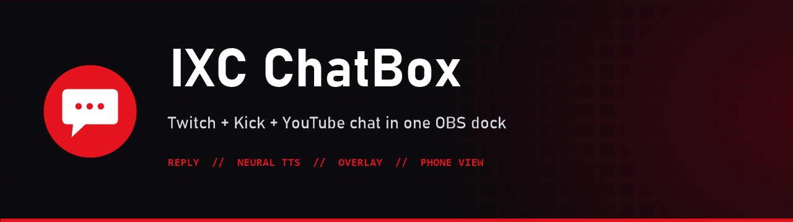

**IXC Suite = IXC Music + IXC ChatBox.** Twitch, Kick, YouTube and Rumble chat in one place, a chat voice (TTS), a music player
with song requests, overlays, and a phone remote that works on mobile data. Made for OBS. **No Streamer.bot needed.**

[**⬇ Download IXC-Setup.exe**](https://github.com/infernoxc/ixc-chatbox/releases/latest) · [**📖 Step-by-step guide**](docs/GUIDE.md) · [Install](docs/INSTALL.md) · [How to use](docs/USAGE.md) · [Something wrong?](docs/TROUBLESHOOTING.md)

---

## Get started (5 minutes)

1. **Download** `IXC-Setup.exe` from [Releases](https://github.com/infernoxc/ixc-chatbox/releases/latest).
2. **Run it** and click **Express setup**. No admin rights needed. *(If OBS is open, the setup asks you to close it once.)*
3. IXC opens and walks you through the rest:
   - It **sets up OBS** by itself.
   - You **connect your platforms** (Twitch, Kick, YouTube: one click each).
   - You can **scan a QR code** with your phone.
   - It **runs a system test**.
4. **Open OBS and stream.** The IXC panels are under **Docks**, and IXC sits in the tray (bottom right).

That's all. You never edit files, ports, JSON or firewall rules.

## What you get
| | |
|---|---|
| 💬 **One chat** | Twitch, Kick, YouTube and Rumble in one panel, with emotes, badges and roles. Reply to one platform or all of them. Show or hide each platform. |
| 🔊 **Chat voice (TTS)** | Reads chat out loud through OBS. 11 natural voices, plus an offline Windows voice as a backup. Give people their own voice, or set one per role or platform. Pause, skip, queue, history. |
| 🎚 **Music ducking** | Music fades down smoothly while the voice speaks, then comes back to exactly where it was. |
| 🎵 **Music** | YouTube search and links, Spotify links (matched on YouTube), your own MP3/FLAC/… folders. Queue, shuffle, repeat, autoplay. Send the music to **all platforms or only one** (for example, YouTube only). |
| 🙋 **Song requests** | `!sr song name` from chat, with who-can-request, cooldowns, limits, banned songs/artists and a maximum length. `!wrongsong` removes your last request. |
| ⌨️ **Commands** | `!np` `!queue` `!skip` `!uptime` `!viewers` and your own (`!discord`, `!socials`…) with permissions, cooldowns and platforms. |
| 🛡 **Chat filters** | Links, caps, spam, copy-paste waves, banned words, block and allow lists, "subscribers only" on stream. You still see everything in your panel. |
| 👁 **Viewer counter** | Per platform and total. A number that's out of date is never shown as current. |
| 🖼 **Overlays** | Now Playing (full / compact / minimal), Up Next, Chat, Viewers, Alerts (follows, subs, raids, Super Chats), chat-voice indicator and a "Live on" badge. Style them in IXC and press **Add to OBS**. |
| 📱 **Phone remote** | Scan a QR code once, then control music, voice and chat from anywhere: 4G/5G, another Wi-Fi, another city. It keeps working after restarts. |
| 🩺 **System check** | One button checks everything; **Fix automatically** repairs it. Backups, diagnostics export, safe updates with rollback. |

## Requirements
- **Windows 10 (1903 or newer) or Windows 11.** Everything else IXC needs is built into Windows.
- **OBS Studio 30 or newer** (free, [obsproject.com](https://obsproject.com)).
- **Internet** for the platforms, neural voices, YouTube and the phone remote. Local music and the offline voice work without it.
- **Streamer.bot is optional.** If you already use it, IXC uses it too, for example to reply on platforms you haven't connected in IXC.

## Honest limitations
- **Neural voices** use Microsoft Edge's "Read aloud" service, which isn't an official API. If it ever stops, IXC switches to the offline Windows voice by itself and tells you.
- **Reading chat** on Kick and YouTube uses the same public connections their websites use, and these can change. Replying uses the official APIs (you sign in).
- **Followers:** follower alerts and "followers only" checks work on Twitch (signed in), Kick and Rumble. YouTube doesn't share them.
- **Spotify** audio can't be streamed. IXC plays the same song from YouTube. Spotify playlists and albums need your own free Spotify app keys (Settings, Advanced).
- **Music copyright:** use music you're allowed to stream (for example NCS or StreamBeats). Platforms mute or strike copyrighted music.

## Documentation
[Step-by-step guide](docs/GUIDE.md) · [Install](docs/INSTALL.md) · [Usage](docs/USAGE.md) · [Troubleshooting](docs/TROUBLESHOOTING.md) · [Update & uninstall](docs/UNINSTALL.md) · [All settings](docs/CONFIGURATION.md)
· For developers: [Architecture & API](docs/ARCHITECTURE.md) · [Developer setup (relay, sign-in apps)](docs/DEVELOPER-SETUP.md) · [Releasing](docs/RELEASING.md) · [Contributing & tests](CONTRIBUTING.md)

## Privacy and security
- Everything runs **on your PC**. IXC only listens on your PC's own address (`localhost`) and refuses requests from websites.
- **Sign-ins and keys are encrypted** for your Windows user and never written to settings files, logs or diagnostics.
- The **phone remote** dials *out* to a relay. Nothing on your PC is opened to the internet. Each phone gets its own key, which you can rename or remove at any time. QR codes work once and expire after 5 minutes. Details: [SECURITY.md](SECURITY.md).

## License and credits
Code © 2026 **Ishan (InFerNoxC)**, [MIT License](LICENSE). OBS Studio, Streamer.bot, Twitch, Kick, YouTube, Rumble, Spotify,
Microsoft's voices and Cloudflare belong to their owners: see [THIRD-PARTY-NOTICES.md](THIRD-PARTY-NOTICES.md). Not affiliated with any of them.

Made by <a href="https://github.com/infernoxc">InFerNoxC</a> for multistreamers who are tired of five windows.

