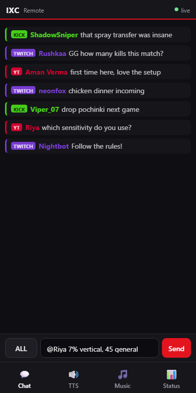
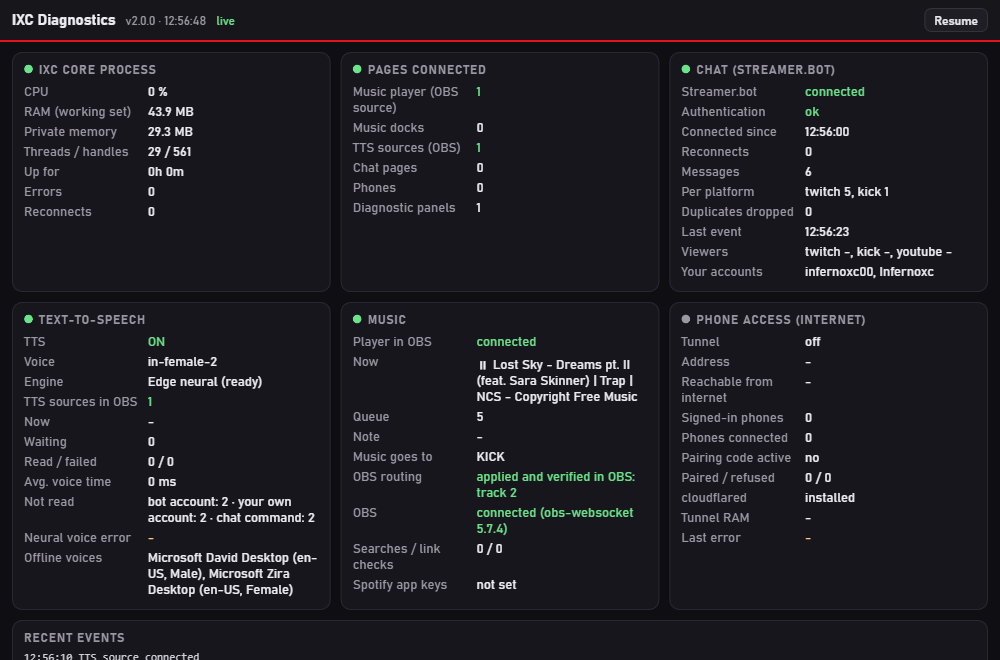

# Using IXC ChatBox

## Dock vs overlay
| Mode | URL | What you get |
|---|---|---|
| **Dock** (for you) | `http://localhost:8767/chat/chat.html?dock=1&viewers=1` | Scrolling chat, viewer counts, TTS bar, reply box, 📱 phone button |
| **Overlay** (for viewers) | `http://localhost:8767/chat/chat.html?max=6&fade=45` | Transparent, newest at the bottom, messages fade after `fade` seconds |
| **Demo** | add `&demo=1` | Fake messages, to try the look without Streamer.bot |

When a page opens (or OBS restarts) it shows the last messages right away. Deleted messages and messages from banned users are removed.

## Replying
- The button left of the text box picks the target: **ALL**, **TWITCH**, **KICK**, **YT**. Click it to switch.
- **Enter** sends. A note confirms, e.g. "✓ sent to TWITCH + KICK", or says why a platform failed. YouTube only accepts messages while you're live.
- `!` lists your bot commands, `@` lists chatters. Choose with ↑ ↓ and Tab/Enter. Click a message to reply to that person.
- Messages are sent **as your broadcaster account** through Streamer.bot.

## Text-to-speech
IXC decides what to read on your PC, so TTS works whenever IXC is running: with or without the dock open, and after OBS restarts.
The **IXC ChatBox TTS** browser source only plays the audio, so viewers hear it on the tracks you give that source.

**In the dock bar:** **TTS ON/OFF**, the voice, what to read (*read all*, *name + message*, *only `!tts` messages*), **Test** and **Skip**.
The ⚙ button opens everything else:

| Section | What you can do |
|---|---|
| Queue | See what's playing and waiting; **Skip current**, **Clear queue** |
| Voice | Speed (-50 … +100 %), pitch, volume, and the offline Windows voice as automatic fallback |
| What gets read | Ignore my own account, ignore bot accounts, read emote names / emoji / links (all off by default), max length |
| Lists | **Never speak these users**, **skip messages containing** words, extra bot names, your other account names |
| Busy chat | Queue size, "too old" time, max messages per minute, wait between messages of the same user |
| Recently read | Every message with a **↻ replay** button |
| Not read (and why) | e.g. "your own account", "bot account", "chat command", "mirrored on another platform", "busy chat" |

**Voices** (★ = new in v2):

| Voice | Engine |
|---|---|
| Indian male – Prabhat · Indian female – Neerja | Microsoft neural |
| ★ Indian female 2 – **Neerja Expressive** (8 % faster) | Microsoft neural |
| ★ Indian male 2 – **Madhur** (10 % faster; a Hindi voice reading English with an Indian accent) | Microsoft neural |
| US male – Andrew · US female – Jenny · Jarvis-style – Ryan (UK) | Microsoft neural |
| Windows voice (offline) | Voices installed in Windows. Indian ones (Heera, Ravi) need the *English (India)* speech pack: Settings › Time & language › Speech › Add voices |

**How chat is cleaned before it's read:**
- links become "link";
- emotes, emoji and symbols are dropped;
- "noooooo" becomes "noo", and "lol lol lol lol" becomes "lol lol";
- long digit strings become "a long number";
- shouting is read in normal case;
- `@user_name123` is read as "user name";
- long messages are cut at a word.

Commands (`!…`) are never read, except `!tts <text>`, which goes to the front of the queue.

**The same message on several platforms** (your "ALL" replies, or a viewer chatting on two platforms) is read once. When Streamer.bot
re-sends an event after a reconnect, it's recognised by its message id and shown once.

## Phone remote (works on mobile data)

1. In the dock press **📱**. The first time, IXC downloads Cloudflare's official tunnel program, `cloudflared` (about 50 MB), and checks its digital signature.
2. Scan the QR code with your phone camera. The code works **once** and expires after **5 minutes**.
3. Your phone gets four tabs:
   - **Chat:** live chat with a reply box.
   - **TTS:** switch, voice, speed, volume, test/skip/clear, queue, history with replay, and the never-speak list.
   - **Music** (if IXC Music is installed): now playing, controls, volume, the Kick/Twitch/YouTube-only switch, adding songs, and the queue.
   - **Status**.

- If the phone loses signal, it reconnects by itself and catches up.
- The phone stays signed in for **12 hours after its last use** (at most 7 days). Restarting IXC, or **Turn phone access off** in the QR window, signs all phones out.
- The tunnel closes by itself after **30 minutes** without a phone. Next time, press 📱 again for a fresh QR code; the web address changes each time.

 

## Diagnostics

Open **`http://localhost:8767/diag`** (Start menu › IXC for OBS › IXC diagnostics), or add it as an OBS dock. It shows:
- Streamer.bot and OBS connection, authentication, reconnects;
- which OBS sources and docks are connected;
- the TTS engine, voice, queue, read/failed counts, and why messages weren't read;
- phone tunnel status, and whether it's reachable from the internet;
- IXC's CPU, RAM, threads and errors, and the recent events.

It costs nothing while closed. To turn it off completely, set `diagnostics.enabled` to `false`.
